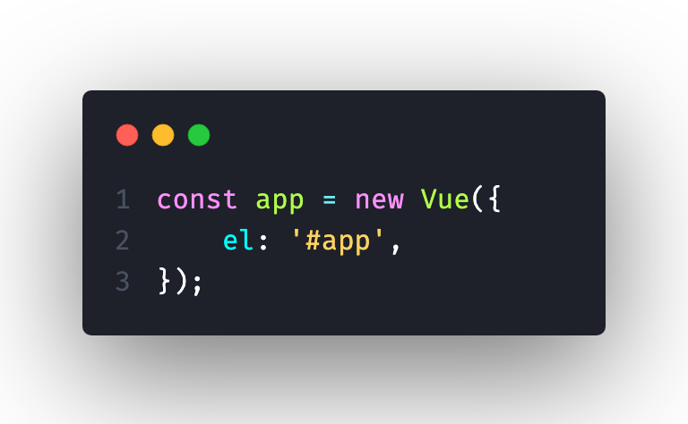
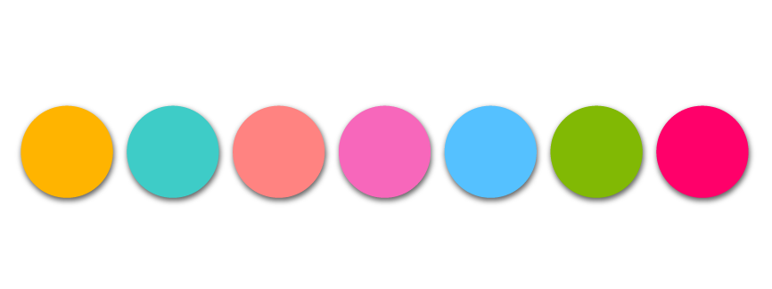

# Material Light Theme

> Code with the elegance and freshness of Material Design  
> *Codifica con la elegancia y frescura de Material Design*

A vibrant, Material Design-inspired light theme with cheerful colors, broad language support, and a polished coding experience.

---

## Preview





---

## Installation

### Via VS Code Marketplace
1. Open **Extensions** (`Cmd+Shift+X` / `Ctrl+Shift+X`)
2. Search for **"Material Light Theme"**
3. Click **Install**
4. Open Command Palette (`Cmd+Shift+P` / `Ctrl+Shift+P`) and select `Preferences: Color Theme` → **Material Light Theme**

### Via VSIX
1. Download the `.vsix` from [Releases](https://github.com/Rafael-117/light-colors-theme/releases)
2. Open Command Palette → `Extensions: Install from VSIX...`
3. Select the downloaded file

---

## Color Palette

| Role | Color | Hex |
|------|-------|:---:|
| Background |  `#fafbfc` | Editor, panels |
| Foreground |  `#464646` | Main text |
| Primary Accent |  `#ff006a` | Selection, status bar, active borders |
| Secondary Accent |  `#55c1ff` | Badges, focus, functions |
| Strings |  `#ffb400` | Strings, markup links |
| Keywords |  `#f767bb` | Keywords, selectors |
| Types |  `#ff006a` | Type annotations, constants |
| Classes |  `#3dccc7` | Classes, regexp |
| Functions |  `#55c1ff` | Function calls |
| Variables |  `#7fb800` | Variables (italic) |
| Numbers |  `#ff5c57` | Numeric constants |
| Comments |  `#adb1c2` | Comments (italic) |
| Errors |  `#ff5c56` | Errors, exceptions |
| Diff Added |  `#ff006a` | Git additions |
| Diff Deleted |  `#ff5c57` | Git deletions |

---

## Supported Languages

JavaScript / TypeScript / JSX / TSX · HTML / CSS / SCSS / Less / Stylus · PHP · Python · Go · Rust · C / C++ · C# · Java · Swift · Kotlin · Scala · Dart · Ruby · Elixir · Elm · Erlang · Haskell · OCaml · Clojure · R · Lua · CoffeeScript · Reason · Objective-C · SQL · YAML · TOML · Markdown · Dockerfile · Shell · Twig · Django · Haml · Handlebars · Pug · WebAssembly · and more

---

## Recommended Settings

For the best experience, pair this theme with:

```json
{
  "editor.fontFamily": "'Cascadia Code', 'Fira Code', 'JetBrains Mono', 'SF Mono', monospace",
  "editor.fontLigatures": true,
  "editor.fontSize": 14,
  "editor.lineHeight": 24,
  "editor.smoothScrolling": true,
  "editor.cursorBlinking": "phase",
  "workbench.colorTheme": "Material Light Theme",
  "workbench.iconTheme": "material-icon-theme"
}
```

---

## Related

Check out the companion dark theme: **[Dark Colors Theme](https://marketplace.visualstudio.com/items?itemName=Rafael-Avalos.dark-colors-theme)**

---

## License

[MIT](LICENSE)

**Enjoy coding with Material Light Theme!** ✨
